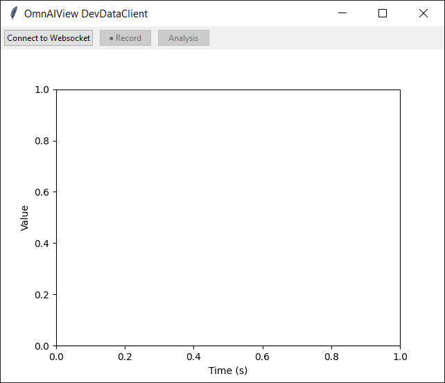
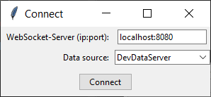
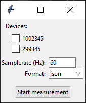
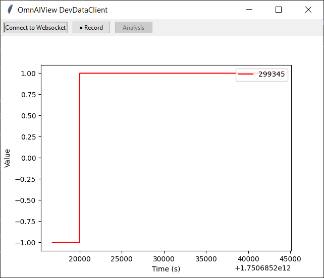

### Getting Started

1. **Starting the Program**
   After starting main.py, the following window appears:

   

2. **Connecting to WebSocket Server**
   When you click the "Connect to Websocket" button in the top left, you will access the server and data source settings.

   

3. **Selecting a Device**
   After clicking "Connect", you can choose from all available data sources. Here you can also set the sample rate and select the desired format.

   

4. **Starting Measurement**
   After clicking "Start measurement", the visualization of incoming data on the graph begins.

   

### Additional Features

- **Record**: Enables recording of measurement data

