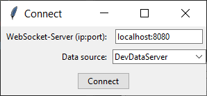
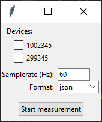

### Erste Schritte

1. **Programm starten**
   Nachdem die main.py gestartet wurde, erscheint folgendes Fenster:

   

2. **Verbindung zum WebSocket-Server herstellen**
   Wenn Sie oben links auf den Button "Connect to Websocket" klicken, gelangen Sie zu den Einstellungen des Servers und der Datenquelle.

   

3. **Gerät auswählen**
   Nachdem Sie auf "Connect" geklickt haben, können Sie aus allen verfügbaren Datenquellen wählen. Hier können Sie auch die Samplerate einstellen und das gewünschte Format auswählen.

   

4. **Messung starten**
   Nach dem Klicken auf "Start measurement" startet die Visualisierung der einkommenden Daten auf dem Graphen.

   

### Zusätzliche Funktionen

- **Record**: Ermöglicht die Aufzeichnung der Messdaten